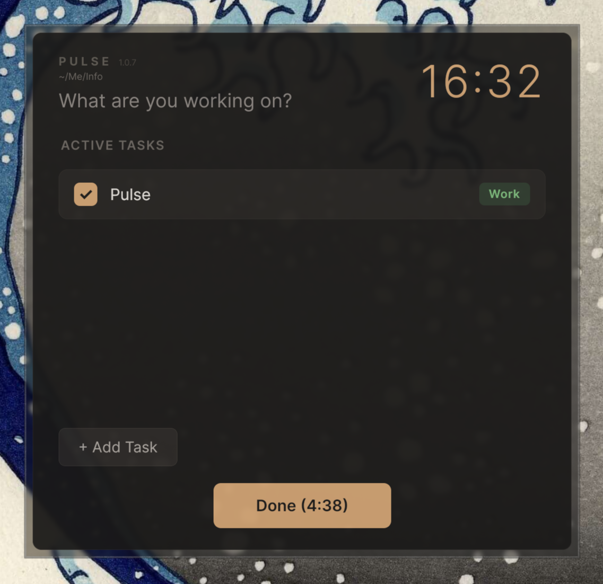

# Pulse

A minimal hourly time tracker that helps you stay aware of how you spend your day.



## Overview

Pulse is a desktop app that pops up every hour on the hour and asks "What are you doing?" You check off active tasks, add new ones, and it quietly logs everything to a markdown file. No complex dashboards, no cloud sync — just honest time awareness.

## Features

- **Hourly check-ins**: Popup appears on the hour (e.g., 9:00, 10:00, 11:00)
- **Parallel tasks**: Track multiple activities simultaneously
- **Auto-close**: Closes after 5 minutes of inactivity with countdown timer
- **Single file storage**: All data in one markdown file with YAML frontmatter
- **Recent tasks**: Quick-add from your last 100 tasks
- **Categories**: Work, Hobby, Relationship, Other
- **Cross-platform**: Built with Avalonia UI (Linux, macOS, Windows)

## Installation

### Requirements

- .NET 9.0 Runtime

### Build from source

```bash
git clone https://github.com/aduggleby/pulse.git
cd pulse
dotnet publish -c Release -r linux-x64 --self-contained false -o dist/linux-x64
```

Replace `linux-x64` with your platform:
- `osx-x64` - macOS Intel
- `osx-arm64` - macOS Apple Silicon
- `win-x64` - Windows

## Configuration

Settings are stored in `~/.config/pulse/settings.json`:

```json
{
  "dataDirectory": "~/pulse"
}
```

- `dataDirectory`: Where Pulse stores data (default: `~/pulse`)
  - `Today.md` - today's log and active state
  - `Archive/YYYY-MM-DD.md` - archived daily logs with time summaries

Categories can be customized by editing the `categories` field in the YAML frontmatter of `Today.md`:

```yaml
---
categories:
  - Work
  - Hobby
  - Exercise
  - Family
---
```

## Data Format

Pulse stores today's data in `Today.md` and archives previous days to `Archive/YYYY-MM-DD.md`. Works great with Obsidian.

### Today.md

```markdown
---
active:
  - description: Code review
    category: Work
    started: 2026-01-30T14:00
recent:
  - description: Writing code
    category: Work
lastCheckIn: 2026-01-30T15:00
---

# Pulse Log

## 2026-01-30

- [Work] Writing code (09:00 - 12:00, 14:00 - 17:00)
- [Hobby] Reading (12:00 - 13:00)
```

### Archive/YYYY-MM-DD.md

Daily archives include a summary of time spent per task:

```markdown
# 2026-01-30

## Summary

- **Writing code**: 6h 0m
- **Reading**: 1h 0m

## Log

- [Work] Writing code (09:00 - 12:00, 14:00 - 17:00)
- [Hobby] Reading (12:00 - 13:00)
```

## License

MIT License - see [LICENSE](LICENSE)

## Related Repos

- `localsend-cli`: Headless LocalSend CLI for automation and LLM control.
